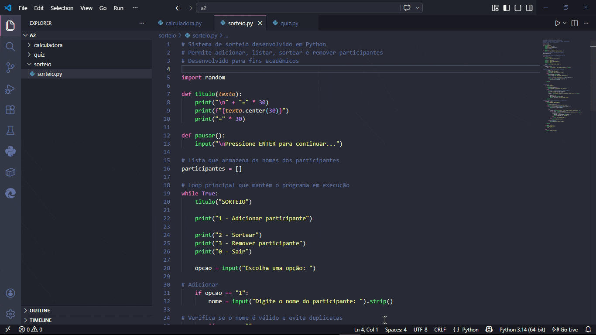

🎲 Sistema de Sorteio

Sistema simples de sorteio desenvolvido em Python, permitindo gerenciar participantes e realizar sorteios de forma prática.

📌 Funcionalidades

- Adicionar participantes
- Listar participantes cadastrados
- Sortear um participante aleatório
- Remover participantes da lista

🚀 Como executar o projeto

-Certifique-se de ter o Python instalado em sua máquina
-Clone este repositório ou baixe os arquivos
-Abra o terminal na pasta do projeto
-Execute o arquivo principal:

python nome_do_arquivo.py

💻 Tecnologias utilizadas

- Python
- Biblioteca random

📚 Objetivo do projeto

Este projeto foi desenvolvido para fins acadêmicos, com o intuito de reforçar conceitos básicos de programação, como:

- Estruturas de repetição
- Condicionais
- Listas
- Funções

✍️ Autor

Fabricio Ramos Oliveira
